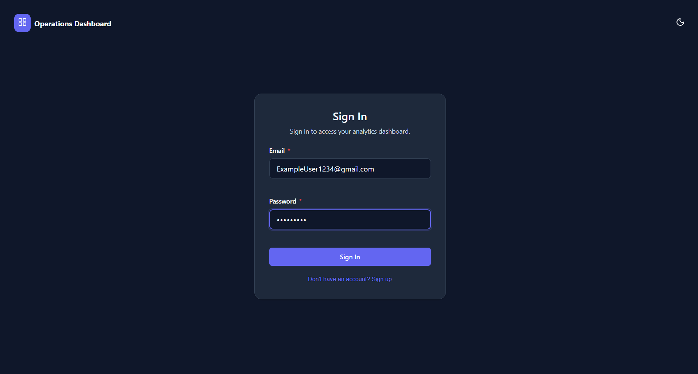
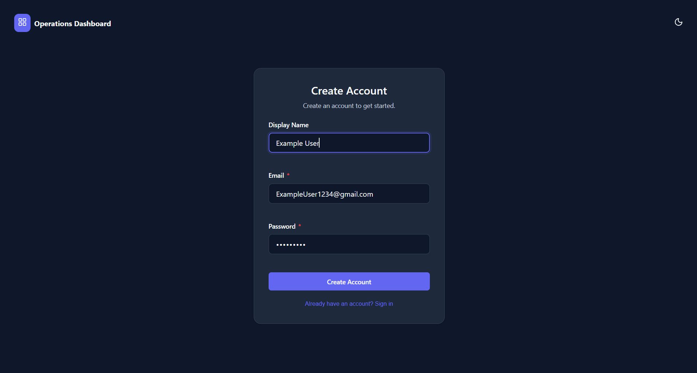
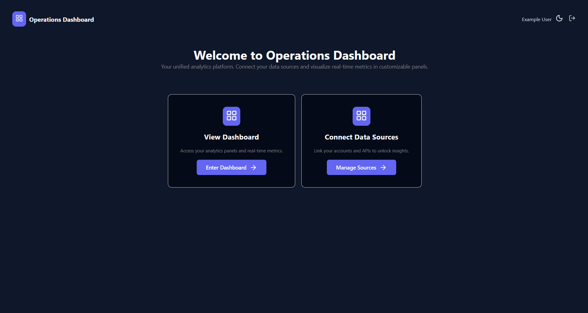
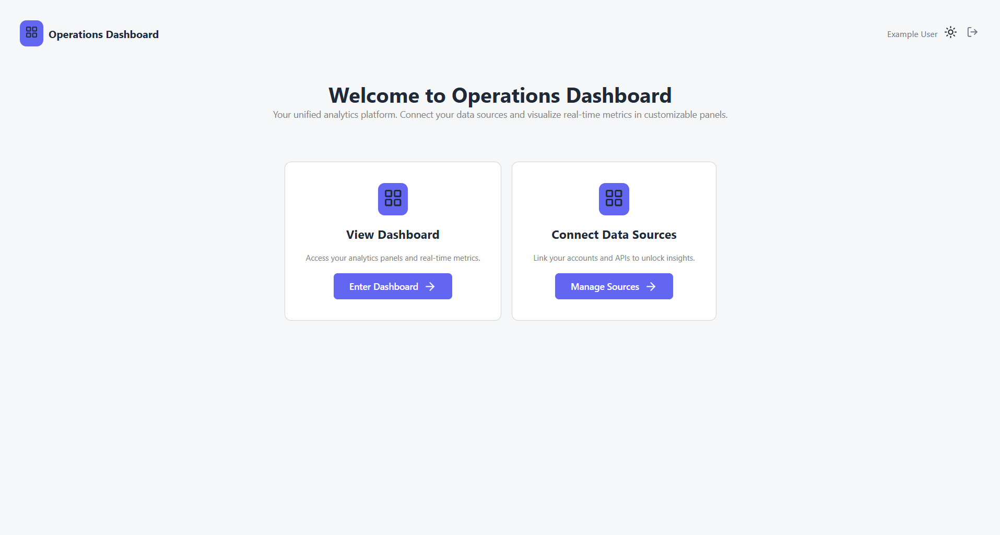
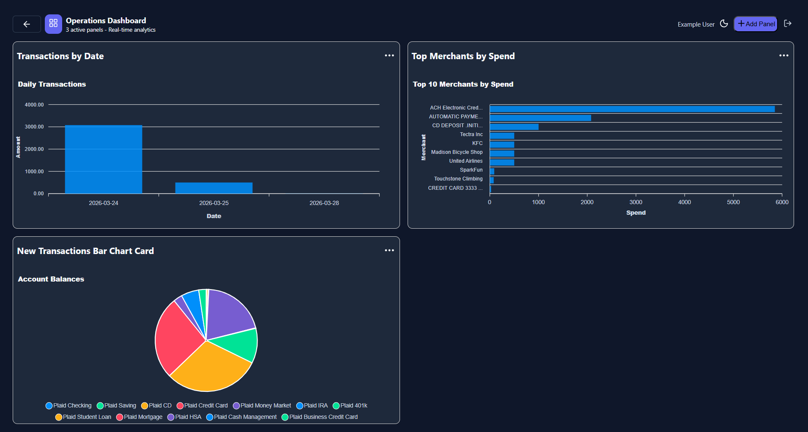
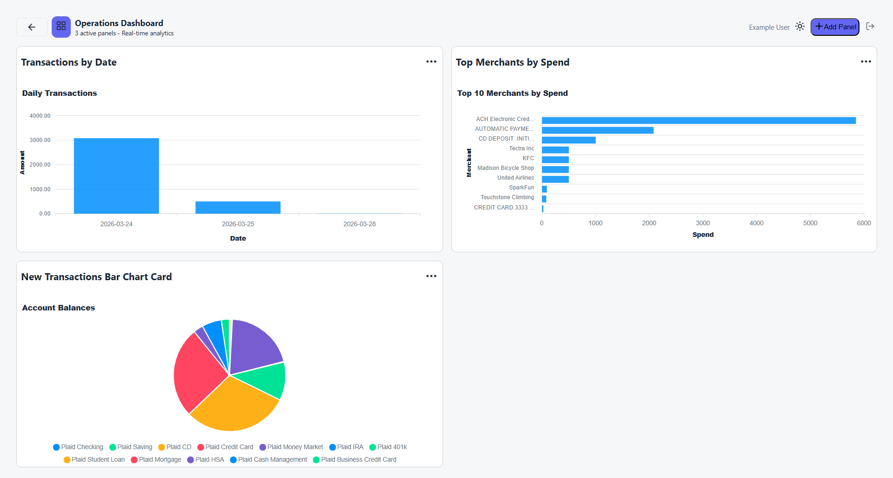
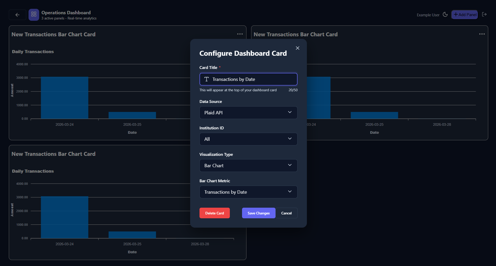
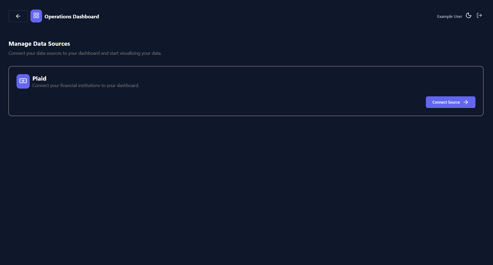
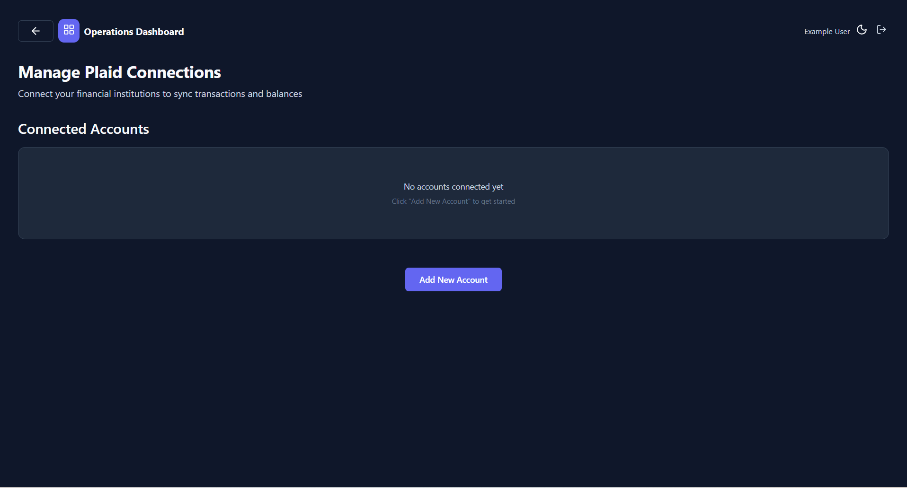
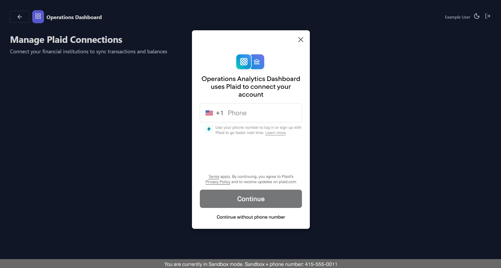

# Operations Analytics Dashboard

A monorepo containing the backend and frontend for the Operations Analytics Dashboard application.

## Prerequisites

Before you begin, ensure you have the following installed on your system:

### Backend Requirements
- **Java**: 21
  - Verify installation: `java -version`
- **Gradle**: 9.2.1 (managed via Gradle wrapper - no manual installation required)
  - The project includes a Gradle wrapper (`gradlew` / `gradlew.bat`) that will automatically download the correct Gradle version

### Frontend Requirements
- **Node.js**: >=20.0.0 (tested with v20.19.5)
  - Verify installation: `node --version`
  - Download from [nodejs.org](https://nodejs.org/)
- **npm**: >=10.0.0 (tested with 10.8.2)
  - Verify installation: `npm --version`
  - npm comes bundled with Node.js

## Technology Stack

### Backend
- **Java**: 21
- **Spring Boot**: 4.0.1
- **Gradle**: 9.2.1
- **MyBatis**: 4.0.0
- **PostgreSQL**: (runtime dependency)
- **Liquibase**: (for database migrations)

### Frontend
- **Angular**: 20.3.0
- **Angular CLI**: 20.3.3
- **TypeScript**: 5.9.2
- **RxJS**: 7.8.0

## Screenshots

### Authentication

| Sign In | Create Account |
|---|---|
|  |  |

### Landing Page

| Dark Mode | Light Mode |
|---|---|
|  |  |

### Analytics Dashboard

| Dark Mode | Light Mode |
|---|---|
|  |  |

### Configuring a Dashboard Card



### Managing Data Sources

| Data Sources | Plaid Connections | Connect via Plaid |
|---|---|---|
|  |  |  |

---

## Getting Started

### Backend Setup

1. Navigate to the backend directory:
   ```bash
   cd backend
   ```

2. Build the project:
   ```bash
   # On Windows
   gradlew.bat build
   
   # On Unix/Mac
   ./gradlew build
   ```

3. Run the application:
   ```bash
   # On Windows
   gradlew.bat bootRun
   
   # On Unix/Mac
   ./gradlew bootRun
   ```

4. The backend will start on `http://localhost:8080` (default Spring Boot port)

For more backend documentation, see [backend/HELP.md](backend/HELP.md)

### Frontend Setup

1. Navigate to the frontend directory:
   ```bash
   cd frontend
   ```

2. Install dependencies:
   ```bash
   npm install
   ```

3. Start the development server:
   ```bash
   npm start
   # or
   ng serve
   ```

4. Open your browser and navigate to `http://localhost:4200`

5. The application will automatically reload when you modify source files

For more frontend documentation, see [frontend/README.md](frontend/README.md)

## Project Structure

```
operations-analytics-dashboard/
├── backend/                 # Spring Boot backend application
│   ├── src/
│   │   ├── main/           # Main application code
│   │   └── test/            # Test code
│   ├── build.gradle         # Gradle build configuration
│   └── gradlew              # Gradle wrapper (Unix/Mac)
│   └── gradlew.bat          # Gradle wrapper (Windows)
│
├── frontend/                # Angular frontend application
│   ├── src/
│   │   └── app/             # Angular application code
│   ├── package.json         # npm dependencies and scripts
│   └── angular.json         # Angular CLI configuration
│
└── README.md                # This file
```

## Development

### Running Both Services

To run both backend and frontend simultaneously:

1. **Terminal 1** - Start the backend:
   ```bash
   cd backend
   ./gradlew bootRun
   ```

2. **Terminal 2** - Start the frontend:
   ```bash
   cd frontend
   npm start
   ```

### Building for Production

**Backend:**
```bash
cd backend
./gradlew build
```
The JAR file will be created in `backend/build/libs/`

**Frontend:**
```bash
cd frontend
npm run build
```
The production build will be in `frontend/dist/`

## Additional Resources

- [Angular Documentation](https://angular.dev)
- [Spring Boot Documentation](https://docs.spring.io/spring-boot/4.0.1/reference/htmlsingle/)
- [Gradle Documentation](https://docs.gradle.org)

