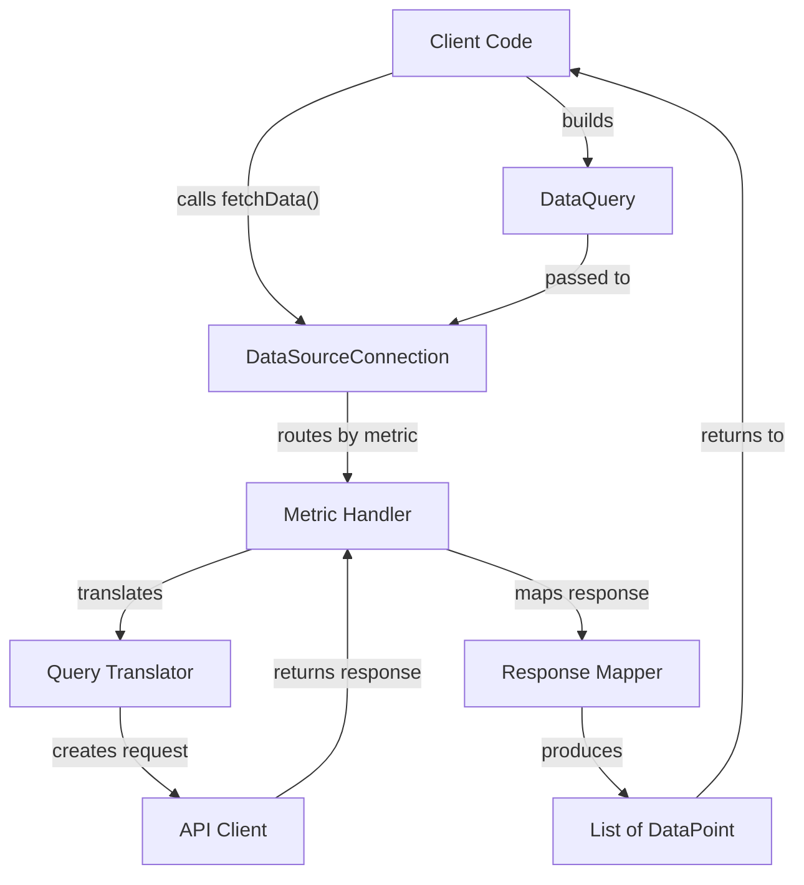
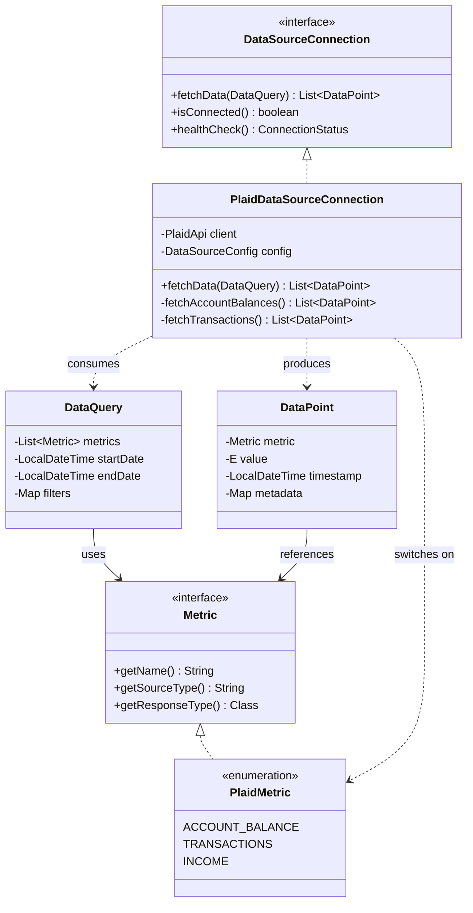
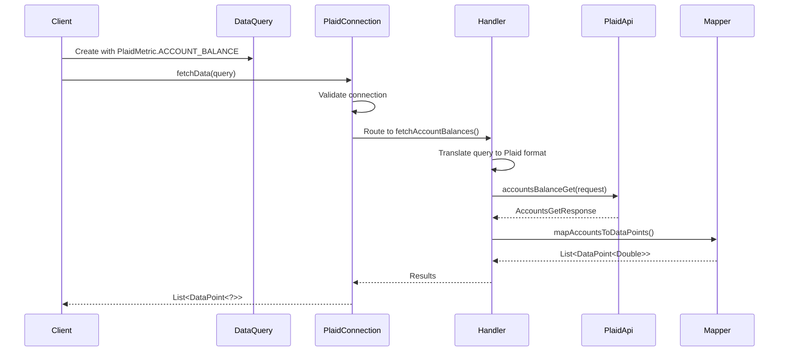

# Data Query and Data Point Abstraction Architecture

## Overview

This document outlines the architectural philosophy and patterns used to abstract data source queries and responses through the `DataQuery` and `DataPoint` models. The goal is to create a flexible, extensible system that allows multiple heterogeneous data sources to be queried uniformly while preserving type safety and enabling source-specific optimizations.

## Core Philosophy

### 1. Separation of Concerns

Our architecture maintains clear boundaries between different responsibilities:

- **Query Intent** (`DataQuery`) is separate from **Query Execution** (`DataSourceConnection`)
  - The query expresses *what* data is needed, not *how* to fetch it
  - Each data source implements its own fetching logic behind a common interface

- **Data Structure** (`DataPoint`) is separate from **Data Fetching** (metric handlers)
  - DataPoints provide a uniform container regardless of source
  - Handlers are responsible for transforming source-specific responses

- **Metric Identity** (`Metric` interface) is separate from **Metric Implementation** (source-specific enums)
  - The interface defines the contract
  - Each data source implements its own set of metrics as enums

This separation enables:
- Independent evolution of components
- Testing in isolation
- Clear ownership of responsibilities
- Easier debugging and maintenance

### 2. Interface-Based Polymorphism

Rather than using strings, magic constants, or conditional logic scattered throughout the codebase, we use typed interfaces that implementations can specialize:

- **`Metric` interface** allows each data source to define its own enum of metrics
  - Compile-time safety: No typos in metric names
  - IDE support: Autocomplete shows available metrics
  - Refactoring friendly: Rename operations work correctly

- **`DataSourceConnection` interface** standardizes the query/fetch contract
  - All sources implement the same `fetchData(DataQuery query)` method
  - Polymorphic behavior: Treat different sources uniformly
  - Extensibility: Add new sources without modifying existing code

- **Compile-time safety with runtime flexibility**
  - Enums provide exhaustive switch checking
  - Interfaces allow dynamic behavior
  - Type system catches errors early

### 3. Generic Type Safety

We leverage Java generics to preserve type information while maintaining flexibility:

- **`DataPoint<E>`** preserves type information for values
  - `DataPoint<Double>` for account balances
  - `DataPoint<Transaction>` for transaction lists
  - Type parameter flows through the entire processing pipeline

- **`Class<?>` in Metric enums** for runtime type checking
  - Each metric knows its expected response type
  - Enables type-safe deserialization
  - Works around Java's enum generic limitations (explained in Design Decisions)

- **Generic methods** enable flexible processing
  - `<E> List<DataPoint<E>> fetchData(DataQuery query)` adapts to any return type
  - Consumers can work with heterogeneous results

### 4. Alignment with Product Purpose

These architectural decisions directly support the product's core value proposition:

> **Value**: Faster insight, lower cognitive load and extensible analytics without re-engineering dashboards every time a new datasource is added.

- **Lower Cognitive Load**: Uniform `DataQuery`/`DataPoint` API across all sources
- **Extensibility**: New sources added by implementing interfaces, not modifying core logic
- **Faster Insight**: Type-safe queries reduce debugging time
- **No Re-engineering**: Existing queries work with new sources automatically

## Pattern Catalog

### Pattern 1: Metric Interface Pattern

#### Problem Statement

How do we identify what data to fetch without using error-prone strings? String-based identifiers lead to:
- Runtime errors from typos
- No IDE support or autocomplete
- Difficult refactoring
- No compile-time validation
- Poor discoverability of available metrics

#### Solution

Define a `Metric` interface that all data sources implement via enums:

```java
public interface Metric {
    String getName();
    String getSourceType();
    Class<?> getResponseType();
}
```

Each data source creates an enum implementing this interface:

```java
public enum PlaidMetric implements Metric {
    ACCOUNT_BALANCE(Double.class),
    TRANSACTIONS(Transaction.class),
    INCOME(Income.class);
    
    private final Class<?> responseType;
    
    PlaidMetric(Class<?> responseType) {
        this.responseType = responseType;
    }
    
    @Override
    public String getName() {
        return this.name().toLowerCase();
    }
    
    @Override
    public String getSourceType() {
        return SourceTypes.PLAID;
    }
    
    @Override
    public Class<?> getResponseType() {
        return responseType;
    }
}
```

#### Benefits

1. **Type Safety**: Compiler catches invalid metrics at compile time
2. **IDE Support**: Autocomplete shows all available metrics for a source
3. **Refactoring Friendly**: Rename/move operations work correctly
4. **Self-Documenting**: Enum values serve as documentation of capabilities
5. **Exhaustive Checking**: Switch statements can be checked for completeness
6. **Runtime Introspection**: Can query available metrics dynamically

#### Tradeoffs

- **Per-Source Enums**: Each source needs its own enum (but this is actually a feature)
- **Enum Limitations**: Can't use generics on individual constants (solved with `Class<?>`)
- **Boilerplate**: Each enum needs to implement interface methods (minimal with Lombok if needed)

#### Usage

In `DataQuery`:
```java
@Data
@Builder
public class DataQuery {
    private List<Metric> metrics;  // Can mix metrics from different sources
    private LocalDateTime startDate;
    private LocalDateTime endDate;
    private Map<String, String> filters;
}
```

In `DataPoint`:
```java
@Data
public class DataPoint<E> {
    private Metric metric;  // References the actual enum constant
    private E value;
    private LocalDateTime timestamp;
    private Map<String, Object> metadata;
}
```

Building a query:
```java
DataQuery query = DataQuery.builder()
    .metrics(Arrays.asList(
        PlaidMetric.ACCOUNT_BALANCE,
        PlaidMetric.TRANSACTIONS
    ))
    .startDate(LocalDateTime.now().minusDays(30))
    .endDate(LocalDateTime.now())
    .build();
```

### Pattern 2: Query Translator Pattern

#### Problem Statement

How do we convert generic `DataQuery` requests into source-specific API calls? Each data source has:
- Different API endpoints
- Different request formats
- Different authentication mechanisms
- Different parameter names and structures
- Different rate limits and pagination

We need to translate our generic query into the native format without leaking implementation details.

#### Solution Architecture

Create a translation layer within each `DataSourceConnection` implementation that converts generic queries to native API requests:

```
DataQuery (generic) 
    ↓
DataSourceConnection.fetchData()
    ↓
Metric-specific handler
    ↓
Query Translator (implicit in handler)
    ↓
Native API Request (Plaid, Stripe, etc.)
    ↓
API Client executes request
    ↓
Native Response
```

#### Layers

1. **DataQuery Layer**: Generic query with metrics, date ranges, filters
   - Cross-cutting concerns (date ranges, filters)
   - Metric list (what to fetch)
   - Source-agnostic

2. **Connection Layer**: Routes query to appropriate handlers
   - Validates connection status
   - Iterates through requested metrics
   - Delegates to metric-specific handlers
   - Aggregates results

3. **Metric Handler Layer**: Translates and executes for specific metric
   - Maps generic date range to source-specific parameters
   - Applies filters in source-native way
   - Constructs native API request
   - Calls API client

4. **API Client Layer**: Makes actual HTTP calls to external service
   - Authentication
   - Request/response serialization
   - Error handling
   - Retry logic

5. **Response Mapper Layer**: Transforms API response to DataPoint
   - Covered in Pattern 3

#### Benefits

- **Encapsulation**: Source-specific API details hidden behind interface
- **Testability**: Each layer can be tested independently
- **Maintainability**: API changes only affect the handler layer
- **Clarity**: Each layer has a single, clear responsibility

#### Example: Plaid Implementation

```java
public class PlaidDataSourceConnection implements DataSourceConnection {
    
    @Override
    public <E> List<DataPoint<E>> fetchData(DataQuery query) {
        // Connection layer: orchestrate fetching
        List<DataPoint<E>> results = new ArrayList<>();
        
        for (Metric metric : query.getMetrics()) {
            if (metric instanceof PlaidMetric) {
                results.addAll(fetchMetric((PlaidMetric) metric, query));
            }
        }
        
        return results;
    }
    
    private <E> List<DataPoint<E>> fetchMetric(PlaidMetric metric, DataQuery query) {
        // Metric handler: route to specific implementation
        switch (metric) {
            case ACCOUNT_BALANCE:
                return (List<DataPoint<E>>) fetchAccountBalances(query);
            case TRANSACTIONS:
                return (List<DataPoint<E>>) fetchTransactions(query);
            default:
                throw new UnsupportedOperationException("Unsupported metric: " + metric);
        }
    }
    
    private List<DataPoint<Double>> fetchAccountBalances(DataQuery query) {
        // Translation: generic query → Plaid API request
        String accessToken = config.getCredentials().get("accessToken");
        
        AccountsBalanceGetRequest request = new AccountsBalanceGetRequest()
            .accessToken(accessToken);
        
        // Optionally apply date filters if Plaid API supports them
        // Note: Not all APIs support all filter types
        
        try {
            // API Client: execute request
            Response<AccountsGetResponse> response = plaidClient
                .accountsBalanceGet(request)
                .execute();
            
            if (!response.isSuccessful()) {
                throw new DataSourceException("Failed: " + response.code());
            }
            
            // Response Mapper: transform to DataPoints
            return mapAccountsToDataPoints(response.body(), query);
            
        } catch (IOException e) {
            throw new DataSourceException("Error fetching balances", e);
        }
    }
}
```

### Pattern 3: Response Mapper Pattern

#### Problem Statement

How do we transform diverse API responses into uniform `DataPoint` structures? Each data source returns:
- Different JSON/object structures
- Different field names
- Different timestamp formats
- Different value types
- Different levels of nesting

We need consistent `DataPoint` objects regardless of source.

#### Solution

Each metric handler includes a mapping function that converts the native response into `List<DataPoint<E>>`:

```java
private List<DataPoint<Double>> mapAccountsToDataPoints(
    AccountsGetResponse response, 
    DataQuery query
) {
    List<DataPoint<Double>> dataPoints = new ArrayList<>();
    LocalDateTime timestamp = LocalDateTime.now();
    
    for (Account account : response.getAccounts()) {
        DataPoint<Double> point = new DataPoint<>();
        
        // Set the metric reference
        point.setMetric(PlaidMetric.ACCOUNT_BALANCE);
        
        // Extract the value
        point.setValue(account.getBalances().getCurrent());
        
        // Set timestamp (from response or current time)
        point.setTimestamp(timestamp);
        
        // Populate metadata with source-specific details
        Map<String, Object> metadata = new HashMap<>();
        metadata.put("accountId", account.getAccountId());
        metadata.put("accountName", account.getName());
        metadata.put("accountType", account.getType());
        metadata.put("currency", account.getBalances().getIsoCurrencyCode());
        metadata.put("institutionId", response.getItem().getInstitutionId());
        point.setMetadata(metadata);
        
        dataPoints.add(point);
    }
    
    return dataPoints;
}
```

#### Key Responsibilities

1. **Value Extraction**: Navigate nested structures to find the actual data value
2. **Type Conversion**: Convert source types to expected Java types
3. **Timestamp Handling**: Extract or generate appropriate timestamps
4. **Metadata Population**: Capture relevant context and details
5. **Metric Reference**: Set the correct Metric enum constant
6. **Null Handling**: Deal gracefully with missing/null data
7. **Collection Creation**: Generate one DataPoint per logical data item

#### Benefits

- **Consistency**: All data has the same structure after mapping
- **Isolation**: Mapping logic isolated from fetching logic
- **Testability**: Easy to unit test with mock responses
- **Flexibility**: Different metrics can map differently even from same source
- **Metadata Richness**: Can capture as much or as little context as needed

#### Transformation Examples

**Example 1: Single value per response**
```java
// Plaid returns one balance per account
Account → DataPoint<Double>
```

**Example 2: Multiple values per response**
```java
// Plaid returns multiple transactions
TransactionsGetResponse → List<DataPoint<Transaction>>
```

**Example 3: Nested structures**
```java
// Investment holdings with nested data
InvestmentHolding {
  security: { name, ticker, type },
  quantity,
  institution_value
} → DataPoint<InvestmentHolding> with flattened metadata
```

**Example 4: Aggregated values**
```java
// Calculate total across accounts
List<Account> → DataPoint<Double> (sum of balances)
```

### Pattern 4: Metric Handler Registry Pattern

#### Problem Statement

How do we avoid large switch statements when adding new metrics? Traditional switch-based dispatch:
- Requires modifying the switch every time a metric is added
- Violates Open/Closed Principle
- Makes testing harder (can't test individual handlers easily)
- Creates merge conflicts in team environments
- Becomes unwieldy with many metrics

#### Solution

Use a registry (Map) that associates metrics with handler functions, allowing dynamic dispatch:

```java
public class PlaidDataSourceConnection implements DataSourceConnection {
    
    private final Map<PlaidMetric, MetricFetcher<?>> fetchers;
    
    public PlaidDataSourceConnection(PlaidApi plaidClient, DataSourceConfig config) {
        this.plaidClient = plaidClient;
        this.config = config;
        this.fetchers = initializeFetchers();
    }
    
    private Map<PlaidMetric, MetricFetcher<?>> initializeFetchers() {
        Map<PlaidMetric, MetricFetcher<?>> map = new EnumMap<>(PlaidMetric.class);
        map.put(PlaidMetric.ACCOUNT_BALANCE, this::fetchAccountBalances);
        map.put(PlaidMetric.TRANSACTIONS, this::fetchTransactions);
        map.put(PlaidMetric.INCOME, this::fetchIncome);
        // Add more as needed
        return map;
    }
    
    @Override
    public <E> List<DataPoint<E>> fetchData(DataQuery query) {
        return query.getMetrics().stream()
            .filter(m -> m instanceof PlaidMetric)
            .map(m -> (PlaidMetric) m)
            .flatMap(metric -> fetchMetric(metric, query).stream())
            .collect(Collectors.toList());
    }
    
    private <E> List<DataPoint<E>> fetchMetric(PlaidMetric metric, DataQuery query) {
        MetricFetcher<E> fetcher = (MetricFetcher<E>) fetchers.get(metric);
        if (fetcher == null) {
            throw new UnsupportedOperationException("Metric not supported: " + metric);
        }
        return fetcher.fetch(query);
    }
    
    @FunctionalInterface
    private interface MetricFetcher<E> {
        List<DataPoint<E>> fetch(DataQuery query);
    }
}
```

#### Benefits

1. **Open/Closed Principle**: Add metrics without modifying dispatch logic
2. **Better Testing**: Test individual fetchers in isolation
3. **Cleaner Code**: No large switch statements
4. **Explicit Registration**: Clear what metrics are supported
5. **Dynamic Queries**: Can check at runtime what metrics are available
6. **Parallel Processing**: Easy to parallelize fetching if needed

#### When to Use vs. Simple Switch

**Use Registry Pattern when:**
- You have many metrics (> 5-10)
- Metrics are added frequently
- Multiple developers work on the same source
- You want to enable/disable metrics dynamically
- Testing individual handlers in isolation is important

**Use Simple Switch when:**
- Few metrics (< 5)
- Stable set of metrics
- Single developer or small team
- Simplicity is more valuable than extensibility
- You want exhaustive compile-time checking

#### Example with Switch (Acceptable for Small Sets)

```java
private <E> List<DataPoint<E>> fetchMetric(PlaidMetric metric, DataQuery query) {
    switch (metric) {
        case ACCOUNT_BALANCE:
            return (List<DataPoint<E>>) fetchAccountBalances(query);
        case TRANSACTIONS:
            return (List<DataPoint<E>>) fetchTransactions(query);
        case INCOME:
            return (List<DataPoint<E>>) fetchIncome(query);
        default:
            throw new UnsupportedOperationException("Unsupported metric: " + metric);
    }
}
```

This is perfectly acceptable and has advantages:
- Compiler warns about missing cases
- Easy to understand
- No additional abstraction
- Good for initial implementation

**Recommendation**: Start with switch, refactor to registry if/when you exceed 5-7 metrics.

## Architecture Diagrams

### Overall Data Flow



### Component Relationships



### Plaid Implementation Flow



## Design Decisions

### Why Class<?> Instead of Generics for Metric?

**Problem**: Can't have `enum PlaidMetric<T>` with different type parameters per constant.

**Decision**: Store `Class<?>` in each enum constant.

**Rationale**:
1. **Enum Limitations**: All enum constants must be the same type. `PlaidMetric<Double>` and `PlaidMetric<Transaction>` are incompatible types.

2. **Type Erasure**: Even if syntax allowed it, generics are erased at runtime. `Class<?>` preserves type info.

3. **Runtime Type Checking**: Enables reflection, deserialization, and dynamic type checking:
   ```java
   if (point.getMetric().getResponseType() == Double.class) {
       Double value = (Double) point.getValue();
   }
   ```

4. **Standard Pattern**: Used throughout Java ecosystem (Spring's ResolvableType, Jackson's TypeReference, etc.)

**Alternative Considered**: Make each metric a separate class implementing `Metric<T>`.
- **Rejected**: Loses enum benefits (exhaustive switching, enum sets, value iteration)

### Why Store Metric Reference in DataPoint?

**Problem**: Should DataPoint store the Metric enum or just a String name?

**Decision**: Store the `Metric` object itself.

**Rationale**:
1. **Type Information**: Can query `metric.getResponseType()` for runtime type checks
2. **Source Information**: Can get `metric.getSourceType()` without separate field
3. **Rich Behavior**: Metrics can have helper methods (like `PlaidMetric.fromName()`)
4. **Type Safety**: Can switch on the metric with exhaustive checking
5. **No Lookups**: Don't need to parse strings back to enums

**Tradeoff**: Slightly more memory per DataPoint (reference vs. string), but negligible in practice.

### Why List<Metric> Allows Mixed Sources in One Query?

**Problem**: Should DataQuery be tied to a single data source?

**Decision**: Allow `List<Metric>` with mixed source types.

**Rationale**:
1. **Flexibility**: Some queries naturally span sources (e.g., "financial health" might need both bank and credit data)
2. **Consistent API**: Same query object regardless of whether querying one or multiple sources
3. **Connection Filtering**: Each connection implementation can filter to its own metrics:
   ```java
   query.getMetrics().stream()
       .filter(m -> m instanceof PlaidMetric)
   ```
4. **Future-Proof**: Enables cross-source analytics without API changes

**Usage Pattern**: Higher-level services can query multiple connections with the same DataQuery:
```java
List<DataPoint<?>> results = new ArrayList<>();
results.addAll(plaidConnection.fetchData(query));
results.addAll(stripeConnection.fetchData(query));
```

### Date Range and Filter Handling Strategy

**Problem**: Not all APIs support the same date ranges and filters.

**Decision**: DataQuery includes optional date ranges and generic filters. Each connection implements as much as possible.

**Rationale**:
1. **Best Effort**: Connections do their best to honor the query
2. **Post-Filtering**: If API doesn't support a filter, connection can apply it post-fetch
3. **Documentation**: Each Metric enum can document supported filters
4. **Graceful Degradation**: Better to return unfiltered data with a warning than fail

**Pattern**:
```java
private List<DataPoint<Double>> fetchAccountBalances(DataQuery query) {
    // Plaid doesn't support date filters for balances
    // Fetch all, then filter in memory if needed
    List<DataPoint<Double>> results = fetchFromAPI();
    
    if (query.getStartDate() != null || query.getEndDate() != null) {
        results = results.stream()
            .filter(p -> isInDateRange(p, query))
            .collect(Collectors.toList());
    }
    
    return results;
}
```

## Extension Guide: Adding a New Data Source

Follow these steps to add a new data source (e.g., Stripe, QuickBooks, Google Analytics):

### Step 1: Create Metric Enum

Create a new enum in `components/<source>/enums/` implementing the `Metric` interface:

```java
package com.killeen.dashboard.components.stripe.enums;

import com.killeen.dashboard.components.datasource.model.Metric;
import com.killeen.dashboard.components.datasource.constants.SourceTypes;

public enum StripeMetric implements Metric {
    BALANCE(Balance.class),
    CHARGES(Charge.class),
    CUSTOMERS(Customer.class),
    SUBSCRIPTIONS(Subscription.class);
    
    private final Class<?> responseType;
    
    StripeMetric(Class<?> responseType) {
        this.responseType = responseType;
    }
    
    @Override
    public String getName() {
        return this.name().toLowerCase();
    }
    
    @Override
    public String getSourceType() {
        return SourceTypes.STRIPE; // Add to SourceTypes constants
    }
    
    @Override
    public Class<?> getResponseType() {
        return responseType;
    }
}
```

### Step 2: Implement DataSourceConnector

Create connector in `components/<source>/model/`:

```java
@Component
public class StripeDataSourceConnector implements DataSourceConnector {
    
    @Override
    public String getSourceType() {
        return SourceTypes.STRIPE;
    }
    
    @Override
    public ConnectionStatus testConnection(DataSourceConfig config) {
        // Test API credentials
    }
    
    @Override
    public ConnectionStatus connect(DataSourceConfig config) {
        // Establish connection
    }
    
    @Override
    public ConnectionStatus disconnect(DataSourceConfig config) {
        // Clean up resources
    }
    
    @Override
    public DataSourceConnection createConnection(DataSourceConfig config) {
        return StripeDataSourceConnection.builder()
            .stripeClient(createClient(config))
            .config(config)
            .build();
    }
}
```

### Step 3: Implement DataSourceConnection

Create connection in `components/<source>/model/`:

```java
@Data
@Builder
public class StripeDataSourceConnection implements DataSourceConnection {
    
    private StripeClient stripeClient;
    private DataSourceConfig config;
    
    @Override
    public <E> List<DataPoint<E>> fetchData(DataQuery query) {
        List<DataPoint<E>> results = new ArrayList<>();
        
        for (Metric metric : query.getMetrics()) {
            if (metric instanceof StripeMetric) {
                results.addAll(fetchMetric((StripeMetric) metric, query));
            }
        }
        
        return results;
    }
    
    private <E> List<DataPoint<E>> fetchMetric(StripeMetric metric, DataQuery query) {
        switch (metric) {
            case BALANCE:
                return (List<DataPoint<E>>) fetchBalance(query);
            case CHARGES:
                return (List<DataPoint<E>>) fetchCharges(query);
            // ... other metrics
            default:
                throw new UnsupportedOperationException("Unsupported: " + metric);
        }
    }
    
    // Implement remaining interface methods
}
```

### Step 4: Implement Metric Handlers

For each metric, implement a handler method:

```java
private List<DataPoint<Balance>> fetchBalance(DataQuery query) {
    try {
        // 1. Translate query to Stripe API request
        BalanceRetrieveParams params = BalanceRetrieveParams.builder().build();
        
        // 2. Execute API call
        Balance balance = stripeClient.balance().retrieve(params);
        
        // 3. Map response to DataPoints
        return mapBalanceToDataPoints(balance, query);
        
    } catch (StripeException e) {
        throw new DataSourceException("Error fetching Stripe balance", e);
    }
}

private List<DataPoint<Balance>> mapBalanceToDataPoints(Balance balance, DataQuery query) {
    DataPoint<Balance> point = new DataPoint<>();
    point.setMetric(StripeMetric.BALANCE);
    point.setValue(balance);
    point.setTimestamp(LocalDateTime.now());
    
    Map<String, Object> metadata = new HashMap<>();
    metadata.put("currency", balance.getCurrency());
    metadata.put("available", balance.getAvailable());
    metadata.put("pending", balance.getPending());
    point.setMetadata(metadata);
    
    return Collections.singletonList(point);
}
```

### Step 5: Register with System

Add the source type constant:

```java
// In SourceTypes.java
public final class SourceTypes {
    public static final String PLAID = "PLAID";
    public static final String STRIPE = "STRIPE"; // Add this
}
```

If using Spring, the `@Component` annotation on the connector automatically registers it.

### Step 6: Test

Create unit tests:

```java
@Test
public void testStripeBalanceFetch() {
    DataQuery query = DataQuery.builder()
        .metrics(List.of(StripeMetric.BALANCE))
        .build();
    
    List<DataPoint<?>> results = connection.fetchData(query);
    
    assertThat(results).hasSize(1);
    assertThat(results.get(0).getMetric()).isEqualTo(StripeMetric.BALANCE);
    assertThat(results.get(0).getValue()).isInstanceOf(Balance.class);
}
```

### Checklist

- [ ] Created `<Source>Metric` enum implementing `Metric`
- [ ] Created `<Source>DataSourceConnector` implementing `DataSourceConnector`
- [ ] Created `<Source>DataSourceConnection` implementing `DataSourceConnection`
- [ ] Implemented `fetchData()` method with metric routing
- [ ] Implemented handler methods for each metric
- [ ] Implemented response mappers for each metric
- [ ] Added source type constant to `SourceTypes`
- [ ] Added unit tests for connection and handlers
- [ ] Documented any source-specific quirks or limitations
- [ ] Updated this documentation with source-specific examples if needed

## Examples and Best Practices

### Example 1: Building Type-Safe Queries

```java
// Single source, single metric
DataQuery simpleQuery = DataQuery.builder()
    .metrics(List.of(PlaidMetric.ACCOUNT_BALANCE))
    .build();

// Single source, multiple metrics
DataQuery multiMetricQuery = DataQuery.builder()
    .metrics(Arrays.asList(
        PlaidMetric.ACCOUNT_BALANCE,
        PlaidMetric.TRANSACTIONS,
        PlaidMetric.INCOME
    ))
    .startDate(LocalDateTime.now().minusDays(30))
    .endDate(LocalDateTime.now())
    .build();

// Multiple sources (mixed metrics)
DataQuery crossSourceQuery = DataQuery.builder()
    .metrics(Arrays.asList(
        PlaidMetric.ACCOUNT_BALANCE,
        StripeMetric.CHARGES
    ))
    .startDate(LocalDateTime.now().minusMonths(1))
    .endDate(LocalDateTime.now())
    .filters(Map.of("currency", "USD"))
    .build();
```

### Example 2: Processing Heterogeneous Results

```java
List<DataPoint<?>> results = connection.fetchData(query);

for (DataPoint<?> point : results) {
    // Pattern 1: Switch on metric type
    if (point.getMetric() instanceof PlaidMetric) {
        PlaidMetric plaidMetric = (PlaidMetric) point.getMetric();
        switch (plaidMetric) {
            case ACCOUNT_BALANCE:
                DataPoint<Double> balancePoint = (DataPoint<Double>) point;
                processBalance(balancePoint.getValue());
                break;
            case TRANSACTIONS:
                DataPoint<Transaction> txPoint = (DataPoint<Transaction>) point;
                processTransaction(txPoint.getValue());
                break;
        }
    }
    
    // Pattern 2: Use response type for dispatch
    Class<?> responseType = point.getMetric().getResponseType();
    if (responseType == Double.class) {
        Double value = (Double) point.getValue();
        processNumericValue(value);
    } else if (responseType == Transaction.class) {
        Transaction tx = (Transaction) point.getValue();
        processTransaction(tx);
    }
}
```

### Example 3: Grouping Results by Metric

```java
Map<Metric, List<DataPoint<?>>> byMetric = results.stream()
    .collect(Collectors.groupingBy(DataPoint::getMetric));

// Process each metric's data separately
List<DataPoint<?>> balances = byMetric.get(PlaidMetric.ACCOUNT_BALANCE);
List<DataPoint<?>> transactions = byMetric.get(PlaidMetric.TRANSACTIONS);
```

### Example 4: Error Handling Patterns

```java
// Individual metric failure handling
private <E> List<DataPoint<E>> fetchMetric(PlaidMetric metric, DataQuery query) {
    try {
        switch (metric) {
            case ACCOUNT_BALANCE:
                return (List<DataPoint<E>>) fetchAccountBalances(query);
            // ... other cases
        }
    } catch (DataSourceException e) {
        log.error("Failed to fetch metric {}: {}", metric, e.getMessage());
        // Option 1: Throw and fail entire query
        throw e;
        // Option 2: Return empty list and continue with other metrics
        // return Collections.emptyList();
        // Option 3: Return error DataPoint with metadata
        // return createErrorDataPoint(metric, e);
    }
}

// Connection-level error handling
@Override
public <E> List<DataPoint<E>> fetchData(DataQuery query) {
    if (!isConnected()) {
        throw new DataSourceException("Not connected to " + getSourceType());
    }
    
    List<DataPoint<E>> results = new ArrayList<>();
    List<Metric> failedMetrics = new ArrayList<>();
    
    for (Metric metric : query.getMetrics()) {
        if (metric instanceof PlaidMetric) {
            try {
                results.addAll(fetchMetric((PlaidMetric) metric, query));
            } catch (Exception e) {
                log.error("Failed to fetch {}: {}", metric, e.getMessage());
                failedMetrics.add(metric);
            }
        }
    }
    
    if (!failedMetrics.isEmpty()) {
        log.warn("Query partially completed. Failed metrics: {}", failedMetrics);
    }
    
    return results;
}
```

### Example 5: Testing Approaches

```java
// Unit test: Mock API client
@Test
public void testFetchAccountBalances() {
    // Arrange
    AccountsGetResponse mockResponse = createMockAccountsResponse();
    when(mockPlaidClient.accountsBalanceGet(any())).thenReturn(mockResponse);
    
    DataQuery query = DataQuery.builder()
        .metrics(List.of(PlaidMetric.ACCOUNT_BALANCE))
        .build();
    
    // Act
    List<DataPoint<?>> results = connection.fetchData(query);
    
    // Assert
    assertThat(results).hasSize(2);
    assertThat(results.get(0).getMetric()).isEqualTo(PlaidMetric.ACCOUNT_BALANCE);
    assertThat(results.get(0).getValue()).isInstanceOf(Double.class);
}

// Integration test: Use real API in sandbox mode
@Test
@Tag("integration")
public void testRealPlaidConnection() {
    DataSourceConfig config = createSandboxConfig();
    PlaidDataSourceConnection connection = connector.createConnection(config);
    
    DataQuery query = DataQuery.builder()
        .metrics(List.of(PlaidMetric.ACCOUNT_BALANCE))
        .build();
    
    List<DataPoint<?>> results = connection.fetchData(query);
    
    assertThat(results).isNotEmpty();
    // Verify structure but not exact values (sandbox data varies)
}
```

### Best Practices Summary

1. **Always validate connection state** before fetching
2. **Use EnumMap** when creating metric registries (more efficient than HashMap)
3. **Populate metadata richly** - future consumers will thank you
4. **Handle partial failures gracefully** - don't fail entire query if one metric fails
5. **Log at appropriate levels** - debug for details, info for successes, error for failures
6. **Document API limitations** - not all sources support all filters
7. **Test with real APIs** - mock tests catch logic errors, integration tests catch API changes
8. **Use builder pattern** for queries - more readable and flexible
9. **Consider caching** for expensive metrics - but be mindful of staleness
10. **Think about pagination** - some metrics return large datasets

## References

### Related Documentation

- [Product Purpose](../product-purpose.md) - Understand the "why" behind these architecture decisions
- [DataQuery API](../../backend/src/main/java/com/killeen/dashboard/components/dataquery/model/DataQuery.java) - Query model implementation
- [DataPoint API](../../backend/src/main/java/com/killeen/dashboard/components/datapoint/model/DataPoint.java) - Data point model implementation
- [Metric Interface](../../backend/src/main/java/com/killeen/dashboard/components/datasource/model/Metric.java) - Core metric interface

### External Resources

- [Plaid API Documentation](https://plaid.com/docs/) - Reference for Plaid-specific implementations
- [Strategy Pattern](https://refactoring.guru/design-patterns/strategy) - Core pattern used throughout
- [Open/Closed Principle](https://en.wikipedia.org/wiki/Open%E2%80%93closed_principle) - Design principle we follow

---

**Document Version**: 1.0  
**Last Updated**: 2025-12-31  
**Maintainer**: Development Team

